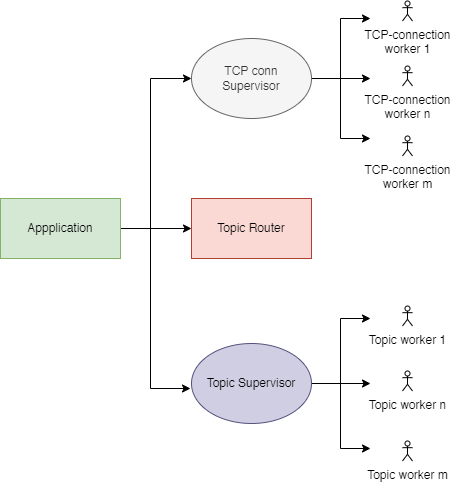
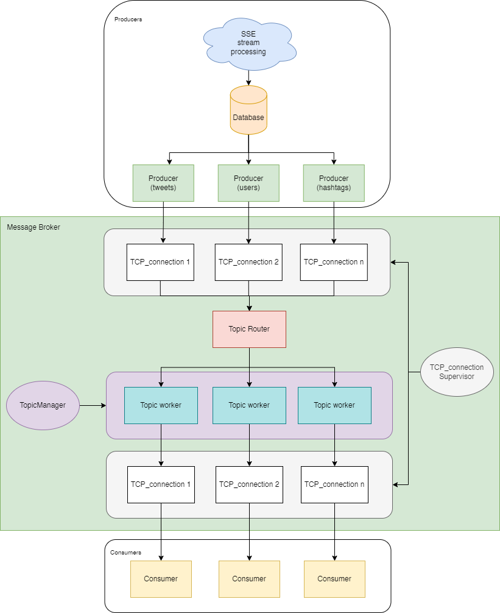
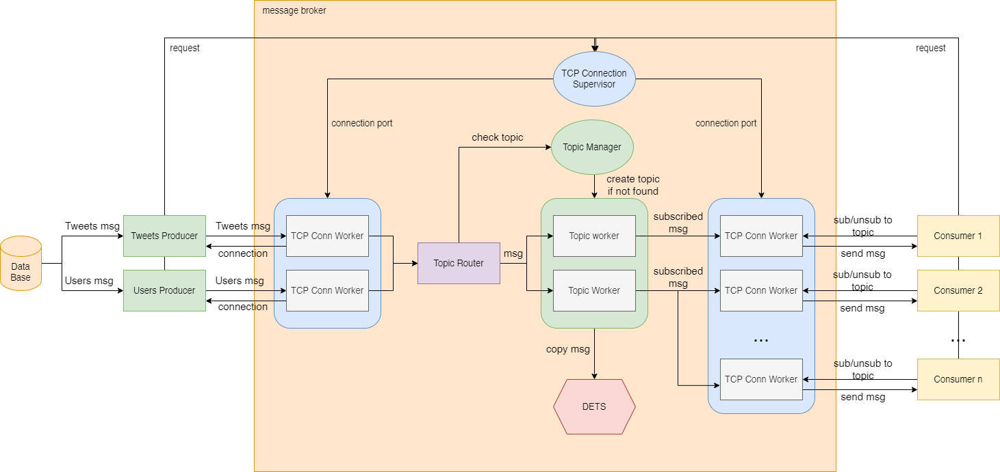

# Luxurious-Jackal-PTR3 Message Broker
## The Task
The task for this laboratory work is to create a message broker that would manage communication  
between producers and consumers. The message broker should have support for multiple topics and  
have the possibility to subscribe and unsubscribe dynamically. You should re-use the application  
developed in labs 1 and 2 as a producer. The applications should be deployed  in docker containers  
and started together using docker compose.

### Language of Choice: Elixir

## Checkpoint #1
### Application Supervision Tree
Here is the diagram of the supervision tree for the application.  
Mainly, there will be 3 supervisors, Application-level supervisor, TCP Connection Supervisor,  
Topic Supervisor.   

### System Architecture Diagram
Diagram showcasing the architecture, composed of 3 applications.

### Data Flow
Diagram showcasing data flow between Producers -> Message Broker -> Consumer

